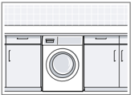
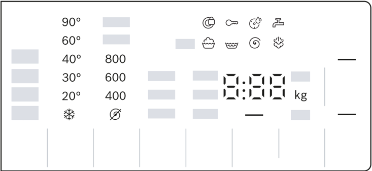
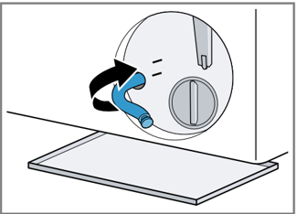

## Washing machine

## WGG254Z0GR

User manual and installation

[en] instructions

## Futher information and explanations are available online:

## Table of contents

| 1 Safety...........................................                      | 1 Safety...........................................                        | 4                           |
|--------------------------------------------------------------------------|----------------------------------------------------------------------------|-----------------------------|
| 1.1                                                                      | General information...................                                     | 4                           |
| 1.2                                                                      | Intended use..............................                                 | 4                           |
| 1.3                                                                      | Restriction on user group..........                                        | 4                           |
| 1.4                                                                      | Safe installation                                                          | ......................... 5 |
| 1.5                                                                      | Safe use ....................................                              | 7                           |
| 1.6                                                                      | Safe cleaning and mainten- ance........................................... | 9                           |
| 2 Preventing material damage ....                                        | 2 Preventing material damage ....                                          | 10                          |
| 3 Environmental protection and saving energy............................ | 3 Environmental protection and saving energy............................   | 11                          |
| 3.1                                                                      | Disposing of packaging ..........                                          | 11                          |
| 3.2                                                                      | Save energy and conserve resources.................................        | 11                          |
| 3.3                                                                      | Energy saving mode ...............                                         | 11                          |
| 4 Installation and connection......                                      | 4 Installation and connection......                                        | 12                          |
| 4.1                                                                      | Unpacking the appliance ........                                           | 12                          |
| 4.2                                                                      | Contents of package...............                                         | 12                          |
| 4.3                                                                      | Requirements for the install- ation location...........................    | 12                          |
| 4.4                                                                      | Removing the transit bolts ......                                          | 13                          |
| 4.5                                                                      | Connecting the appliance .......                                           | 14                          |
| 4.6                                                                      | Aligning the appliance.............                                        | 16                          |
| 5 Familiarising yourself with your appliance...........................  | 5 Familiarising yourself with your appliance...........................    | 17                          |
| 5.1                                                                      | Appliance ................................                                 | 17                          |
| 5.2                                                                      | Detergent drawer.....................                                      | 17                          |
| 5.3                                                                      | Control panel...........................                                   | 18                          |
| 6 Before using for the first time ..                                     | 6 Before using for the first time ..                                       | 19                          |
| 6.1                                                                      | Starting an empty washing cycle ........................................   | 19                          |
| 7                                                                        | Display.......................................                             | 20                          |

| 8 Buttons ......................................                            | 8 Buttons ......................................                            |   23 |
|-----------------------------------------------------------------------------|-----------------------------------------------------------------------------|------|
| 9 Programmes..............................                                  | 9 Programmes..............................                                  |   25 |
| 10 Accessories.............................                                 | 10 Accessories.............................                                 |   29 |
| 11 Laundry....................................                              | 11 Laundry....................................                              |   29 |
| 11.1 Preparing the laundry............                                      | 11.1 Preparing the laundry............                                      |   29 |
| 12 Detergents and care products ..................................          | 12 Detergents and care products ..................................          |   30 |
| 13 Basic operation.......................                                   | 13 Basic operation.......................                                   |   30 |
| 13.1 Switching on the appliance...                                          | 13.1 Switching on the appliance...                                          |   30 |
| 13.2 Setting a programme ............                                       | 13.2 Setting a programme ............                                       |   30 |
| 13.3 Adjusting the programme settings ..................................    | 13.3 Adjusting the programme settings ..................................    |   30 |
| 13.4 Loading laundry.....................                                   | 13.4 Loading laundry.....................                                   |   30 |
| 13.5 Inserting the measuring aid for liquid detergent................       | 13.5 Inserting the measuring aid for liquid detergent................       |   30 |
| 13.6 Use the measuring aid for liquid detergent .....................       | 13.6 Use the measuring aid for liquid detergent .....................       |   31 |
| 13.7 Adding detergent and care product ..................................   | 13.7 Adding detergent and care product ..................................   |   31 |
| 13.8 Starting the programme........                                         | 13.8 Starting the programme........                                         |   32 |
| 13.9 Adding laundry ......................                                  | 13.9 Adding laundry ......................                                  |   32 |
| 13.10 Cancelling the pro- gramme...............................             | 13.10 Cancelling the pro- gramme...............................             |   32 |
| 13.11 Unloading the laundry .........                                       | 13.11 Unloading the laundry .........                                       |   32 |
| 13.12 Switching off the appli- ance.....................................    | 13.12 Switching off the appli- ance.....................................    |   32 |
| 14 Childproof lock........................                                  | 14 Childproof lock........................                                  |   33 |
| 14.1 Activating the childproof lock........................................ | 14.1 Activating the childproof lock........................................ |   33 |
| 14.2                                                                        | Deactivating the childproof lock........................................    |   33 |

| 15 Basic settings..........................                                  |   34 |
|------------------------------------------------------------------------------|------|
| 15.1 Overview of the basic set- tings....................................... |   34 |
| 15.2 Changing the basic set- tings.......................................    |   35 |
| 16 Programme counter................                                         |   35 |
| 16.1 Calling up the programme counter ..................................     |   35 |
| 17 Cleaning and servicing...........                                         |   35 |
| 17.1 Cleaning the drum.................                                      |   35 |
| 17.2 Cleaning the detergent drawer....................................       |   35 |
| 17.3 Cleaning the drain pump.......                                          |   36 |
| 18 Troubleshooting......................                                     |   40 |
| 18.1 Emergency release ...............                                       |   49 |
| 19 Transportation, storage and disposal ...................................  |   49 |
| 19.1 Removing the appliance .......                                          |   49 |
| 19.2 Inserting the transit bolts.......                                      |   49 |
| 19.3 Using the appliance again ....                                          |   49 |
| 19.4 Disposing of old appliance ...                                          |   50 |
| 20 Customer Service....................                                      |   50 |
| 20.1 Product number (E-Nr.) and production number (FD)........               |   50 |
| 21 Consumption values...............                                         |   51 |
| 22 Technical data.........................                                   |   51 |

## 1 Safety

Observe the following safety instructions.

## 1.1 General information

- ¡ Read this instruction manual carefully.
- ¡ Keep the instruction manual and the product information safe for future reference or for the next owner.
- ¡ Do not connect the appliance if it has been damaged in transit.

## 1.2 Intended use

Only use this appliance:

- ¡ For washing machine-washable fabrics and hand-washable wool in accordance with the care label.
- ¡ With tap water and commercially available detergents and care products suitable for washing machines.
- ¡ In private households and in enclosed spaces in a domestic environment.
- ¡ Up to an altitude of max. 4000 m above sea level.

## 1.3 Restriction on user group

This appliance may be used by children aged 8 or over and by people who have reduced physical, sensory or mental abilities or inadequate experience and/or knowledge, provided that they are supervised or have been instructed on how to use the appliance safely and have understood the resulting dangers.

Do not let children play with the appliance.

Cleaning and user maintenance must not be performed by children unless they are being supervised.

Keep children under the age of 3 years and pets away from the appliance.

## 1.4 Safe installation

## WARNING - Risk of electric shock!

Incorrect installation is dangerous.

- Connect and operate the appliance only in accordance with the specifications on the rating plate.
- Connect the appliance to a power supply with alternating current only via a properly installed socket with earthing.
- The protective conductor system of the domestic electrical installation must be properly installed. The installation must have a sufficiently large cross section.
- When using a residual current circuit breaker, only use a type with the mark.
- Never equip the appliance with an external switching device, e.g. a timer or remote control.
- When the appliance is installed, the mains plug of the power cord must be freely accessible. If free access is not possible, an all-pole isolating switch must be installed in the permanent electrical installation according to the installation regulations.
- When installing the appliance, check that the power cable is not trapped or damaged.

If the insulation of the power cord is damaged, this is dangerous.

- Never let the power cord come into contact with hot appliance parts or heat sources.
- Never let the power cord come into contact with sharp points or edges.
- Never kink, crush or modify the power cord.

## WARNING - Risk of fire!

It is dangerous to use an extended power cord and non-approved adapters.

- Do not use extension cables or multiple socket strips.
- Only use adapters and power cords approved by the manufacturer.
- If the power cord is too short and a longer one is not available, please contact an electrician to have the domestic installation adapted.

## WARNING - Risk of injury!

The high weight of the appliance may result in injury when lifted.

Do not lift the appliance on your own.

- If this appliance is not correctly installed in a washer-dryer stack, the installed appliance may fall.
- Only stack the dryer on a washing machine using the connection kit from the dryer manufacturer . No other installation method is permitted.
- Do not install the appliance in a washer-dryer stack if the dryer manufacturer does not offer a suitable connection kit.
- Do not install appliances from different manufacturers and with varying depths and widths in a washer-dryer stack.
- Do not install a washer-dryer stack on a platform; the appliances may tip over.

## WARNING - Risk of suffocation!

Children may put packaging material over their heads or wrap themselves up in it and suffocate.

- Keep packaging material away from children.
- Do not let children play with packaging material.

## CAUTION - Risk of injury!

The appliance may vibrate or move when in use.

- Place the appliance on a clean, even, solid surface.
- Align the appliance using the appliance feet and a spirit level. If hoses and power cords have been laid incorrectly, this causes a tripping hazard.
- Lay hoses and power cords in such a way that there is no risk of tripping.

If the appliance is moved by holding onto protruding components, such as the appliance door, the parts may break off.

- Do not move the appliance by holding onto protruding parts.

## CAUTION - Risk of cutting!

Touching sharp edges on the appliance may lead to cuts.

- Do not touch the sharp edges on the appliance.

- Wear protective gloves when installing and transporting the appliance.

## 1.5 Safe use

## WARNING - Risk of electric shock!

If the appliance or the power cord is damaged, this is dangerous.

- Never operate a damaged appliance.
- Never pull on the power cord to unplug the appliance. Always unplug the appliance at the mains.
- If the appliance or the power cord is damaged, immediately unplug the power cord or switch off the fuse in the fuse box and turn off the water tap.
- Call customer services. → Page 50

An ingress of moisture can cause an electric shock.

- Only use the appliance in enclosed spaces.
- Never expose the appliance to intense heat or humidity.
- Do not use steam- or high-pressure cleaners, hoses or sprays to clean the appliance.

## WARNING - Risk of harm to health!

Children can lock themselves in the appliance, thereby putting their lives at risk.

- Do not install the appliance behind a door as this may obstruct the appliance door or prevent it from opening.
- With redundant appliances, unplug the power cord. Then cut through the cord and damage the lock on the appliance door beyond repair so that the appliance door will no longer close.

## WARNING - Risk of suffocation!

Children may breathe in or swallow small parts, causing them to suffocate.

- Keep small parts away from children.
- Do not let children play with small parts.

## WARNING - Risk of poisoning!

Detergents and care products may result in poisoning if consumed.

- If accidentally swallowed, seek medical advice.
- Keep detergents and care products out of the reach of children.

## WARNING - Risk of explosion!

Laundry that has been pretreated with cleaning agents that contain solvents may cause an explosion in the appliance.

- Rinse pretreated laundry thoroughly with water before washing.

## CAUTION - Risk of injury!

The covering plate may break if you stand on or climb onto the appliance.

- Do not stand on or climb onto the appliance. The appliance may tip over if you sit on or lean against the open

door.

- Do not sit on or lean against the appliance door.
- Do not place any objects on the appliance door.

Reaching into the drum while it is still turning may cause hand injuries.

- Wait for the drum to come to a complete stop before reaching inside.

## CAUTION - Risk of scalding!

When you wash at high temperatures, the detergent solution gets hot.

- Do not touch the hot detergent solution.

## CAUTION - Risk of chemical burns!

If the detergent drawer is opened, detergent and care products may spray out from the appliance. Contact with eyes or skin may cause irritation.

- Rinse eyes and/or skin thoroughly with clean water if they come into contact with detergents or care products.
- If accidentally swallowed, seek medical advice.
- Keep detergents and care products out of the reach of children.

## 1.6 Safe cleaning and maintenance

## WARNING - Risk of electric shock!

Incorrect repairs are dangerous.

- Repairs to the appliance should only be carried out by trained specialist staff.
- Only use genuine spare parts when repairing the appliance.
- If the power cord of this appliance is damaged, it must be replaced by the manufacturer, the manufacturer's Customer Service or a similarly qualified person in order to prevent any risk.

An ingress of moisture can cause an electric shock.

- Do not use steam- or high-pressure cleaners, hoses or sprays to clean the appliance.

## WARNING - Risk of injury!

The use of non-original spare parts and non-original accessories is dangerous.

- Only use the manufacturer's original spare parts and original accessories.

## WARNING - Risk of poisoning!

Poisonous fumes may be given off if you use cleaning agents that contain solvents.

- Do not use cleaning agents that contain solvents.

## 2 Preventing material damage

## ATTENTION!

The functionality of the appliance may be impaired if you use the wrong quantity of fabric softener, detergent, care product or cleaning agent.

- Follow the dosage recommenda-
- tions from the manufacturer. Exceeding the maximum load capa-

city impairs the function of the appliance.

- Observe the maximum load capacity for each programme and do not exceed it.
- → "Programmes", Page 25

The appliance is secured for transportation using transit bolts. Transit bolts which have not been removed may result in material damage and damage to the appliance.

- Before starting up the appliance, remove the transit bolts completely and keep them in a safe place.
- Before transport, fit the transit bolts fully in order to prevent damage in transit.

Material damage may be caused if the water inlet hose is connected incorrectly.

- Tighten the screw connections on the water inlet until they are handtight.
- Ideally, connect the water inlet hose directly to the water tap, without any additional connecting elements such as adapters, extensions, valves or similar.
- Ensure that the inner diameter of the water tap is at least 17 mm.
- Make sure that the length of the thread on the connection to the water tap is at least 10 mm.

If the water pressure is too high or too low, the appliance may not be able to operate properly.

- Ensure that the water pressure in the water supply system is at least 100 kPa (1 bar) and max. 1000 kPa (10 bar).
- If the water pressure exceeds the maximum value specified, a pressure-reducing valve must be installed between the drinking water connection and the hose set of the appliance.
- Do not connect the appliance to the mixer tap of an unpressurised hot-water boiler.

Modified or damaged water hoses may result in material damage and damage to the appliance.

- Never kink, crush, modify or cut through water hoses.
- Only use the water hoses supplied with the appliance or genuine spare hoses.
- Never re-use water hoses that have been used before.

Operating the appliance using water that is dirty or too hot may lead to material damage and damage to the appliance.

- Only operate the appliance with cold mains water.

Unsuitable cleaning products may damage the surfaces of the appliance.

- Do not use harsh or abrasive detergents.
- Do not use cleaning products with a high alcohol content.
- Do not use hard scouring pads or cleaning sponges.
- Clean the appliance with nothing but water and a soft, damp cloth.
- Remove all detergent residue, spray residue or other residues immediately if they come into contact with the appliance.

## 3 Environmental protection and saving energy

## 3.1 Disposing of packaging

The packaging materials are environmentally compatible and can be recycled.

- Sort the individual components by type and dispose of them separately.

## 3.2 Save energy and conserve resources

If you follow these instructions, your appliance will use less electricity and less water.

Choose programmes with low temperatures and longer wash times and use maximum load capacity.

- a Energy consumption and water consumption is most efficient.

Add detergent based on the laundry's degree of soiling.

- a For light to normal soiling, a smaller amount of detergent is sufficient. Observe the dosage recommendation from the detergent manufacturer.

Reduce the washing temperature for lightly and normally soiled laundry.

- a At lower temperatures, the appliance consumes less energy. For light to normal soiling, lower temperatures than indicated on the care label are also sufficient.

Set the maximum spin speed if you want to dry the laundry in the tumble dryer afterwards.

- a The drier the laundry, the shorter the programme duration when drying which, in turn, reduces energy consumption. A higher spin speed reduces the residual moisture in the laundry and increases the volume of the spin noise.

Wash the laundry without prewash.

- a Washing with prewash increases the programme duration and increases energy and water consumption.

The appliance has a continuous automatic load adjustment function.

- a Depending on the type of fabric and load capacity, the continuous automatic load adjustment function optimally adjusts the water consumption and programme duration.

## 3.3 Energy saving mode

If you do not use the appliance for an extended period, it automatically switches to energy-saving mode. Energy-saving mode ends when you use the appliance again.

## 4 Installation and connection

## 4.1 Unpacking the appliance

## ATTENTION!

Objects remaining in the drum that are not designed for operation with the appliance may cause material damage and damage to the appliance.

- Remove these objects, along with all supplied accessories, from the drum before starting the appliance.
1. Remove any packaging and protective covers completely from the appliance.
- → "Disposing of packaging", Page 11
2. Check the appliance for visible damage.
3. Open the door.
4. Remove any accessories from the drum.
5. Close the door.

## 4.2 Contents of package

After unpacking all parts, check for any damage in transit and completeness of the delivery.

## ATTENTION!

If the appliance is operated with incomplete or defective accessories, the appliance may not be able to operate properly, or this may result in material damage or damage to the appliance.

- Do not operate the appliance with incomplete or defective accessories.
- Replace the accessories in question before operating the appliance.
- → "Accessories", Page 29

Note: The appliance has been tested at the factory to check it is in working order. As a result, water stains may remain in the appliance. These marks will disappear after the first wash cycle.

The delivery consists of the following:

- ¡ Washing machine
- ¡ Accompanying documents
- ¡ Transit bolts → "Removing the transit bolts", Page 13
- ¡ Cover caps
- ¡ Water inlet hose → "Connecting the water inlet hose", Page 14

## 4.3 Requirements for the installation location

## WARNING

## Risk of electric shock!

The appliance contains live parts. Touching live parts is dangerous.

- Do not operate the appliance without a cover cap.

## WARNING

## Risk of injury!

When using the appliance on a base, the appliance may tip over.

- Always secure the feet of the appliance to a base using the manufacturer's fixing brackets → Page 29 before using the appliance for the first time.

## ATTENTION!

If residual water in the appliance freezes, this may cause damage to the appliance.

- Do not install or operate this appliance anywhere that is liable to experience frost or outdoors.

If the appliance is tilted at an angle greater than 40°, residual water may leak out of the appliance and cause material damage.

- Tilt the appliance carefully.
- Transport the appliance in an upright position.

| Installation loca- tion   | Requirements                                                                                                                                     |
|---------------------------|--------------------------------------------------------------------------------------------------------------------------------------------------|
| Base                      | Secure the appli- ance with fixing brackets → Page 29 .                                                                                          |
| Wooden joist floor        | Place the appli- ance on a water- resistant wooden board (minimum thickness of 30 mm) which is screwed tightly to the floor.                     |
| Kitchen unit              | Only install the appliance under- neath a continu- ous worktop that is securely con- nected to adja- cent cabinets. Required niche width: 60 cm. |

## Installation location Requirements

## Against a wall

Do not trap the power cord or the hoses between the wall and the appliance.

## 4.4 Removing the transit bolts

The appliance is secured for transportation using transit bolts on the rear of the appliance.

Note: Keep the transit bolt screws and the sleeves in a safe place for future transport.

→ "Inserting the transit bolts", Page 49

1. Pull the hoses out of the holders.

2. Unscrew and remove all the screws for the 4 transit bolts with a WAF 13 wrench.
3. Remove the power cable from the holder.
4. Remove the 4 sleeves.
5. Put on the 4 cover caps.
6. Push the 4 cover caps downwards.

Note: To install the transport locks to transport the appliance, perform these steps again in the reverse order.

## 4.5 Connecting the appliance

## Connecting the water inlet hose

1. Connect the water inlet hose.

2. Connect the water inlet hose to a tap (26.4 mm = 3/4").
3. Open the water tap carefully and check that the connection points are tight.

## Water outlet connection types

This information is intended to help you to connect this appliance to the water outlet.

## ATTENTION!

When draining, the water outlet hose is subject to water pressure and may come loose from the installed connection point.

- Secure the water outlet hose against unintentional loosening.

Note: Observe the draining heights. The maximum draining height is 100 cm.

## Siphon

Secure the connection point with a (24-40 mm) hose clamp.

## Sink

Fix and secure the water outlet hose with an elbow

→ Page 29 .

## Plastic pipe with rubber sleeve or gully

Fix and secure the water outlet hose with an elbow

→ Page 29 .

## Connecting the appliance to the electricity supply

Note: Your electrical domestic installation for this appliance must comply with the local legal provisions and safety regulations, and should include a residual current circuitbreaker.

1. Insert the mains plug of the appliance's power cable in a socket nearby.
2. The connection details of the appliance can be found under Technical data → Page 51 .
2. Check the mains plug is inserted properly.

## 4.6 Aligning the appliance

In order to reduce noise and vibration and to prevent the appliance from moving, align the appliance correctly.

1. Loosen the lock nuts using a WAF 17 wrench by turning it in a clockwise direction.
2. To align the appliance, turn the appliance feet. Check that the appliance is level using a spirit level.
3. Screw the lock nuts tightly against the housing using a WAF 17 wrench.

All appliance feet must stand firmly on the ground.

In doing so, hold the foot tight and do not adjust its height.

## 5 Familiarising yourself with your appliance

## 5.1 Appliance

You can find an overview of the parts of your appliance here.

On certain models, specific details such as the colour and shape may differ from those pictured.

- 2 Maintenance flap for the drain pump → Page 36

## 5.2 Detergent drawer

- 1 Door
- e Detergent drawer → Page 17
- . Control panel → Page 18
- n Water outlet hose → Page 15
- G Power cord → Page 15
- r Transit bolts → Page 13

Note: Observe the manufacturer's instructions on the use and dosage of the detergent and care product and the information in the programme descriptions.

- → "Programmes", Page 25

- e Measuring aid for liquid deter-

gent

- → "Inserting the measuring aid for liquid detergent", Page 30
- n Dispenser II: detergent for the main wash
- t Compartment : Fabric softener
- F Compartment I: Detergent for prewash

## 5.3 Control panel

You can use the control panel to configure all functions of your appliance and to obtain information about the operating status.

- e Programmes → Page 25
- n Programme selector → Page 30
- t Display → Page 20
- F Buttons

first  me

## 6 Before using for the first time

first  me Prepare the appliance for use.

## 6.1 Starting an empty washing cycle

Your appliance was inspected thoroughly before leaving the factory. To remove any residual water, run the first wash cycle without any laundry.

1. Turn the programme selector to Καθαρισμός κάδου .
2. Close the door.
3. Pull out the detergent drawer.
4. Pour approx. 1 litre of tap water into compartment II.
5. Add washing powder that contains a bleaching agent to compartment II.

To prevent foaming, use only half of the amount of detergent recommended by the detergent manufacturer for light soiling. Do not use detergent suitable for woollens or delicates.

6. Push in the detergent drawer.
7. Press Έναρξη/Προσθήκη ρούχων to start the programme.
3. a The display shows the remaining programme duration.
4. a After the programme has ended, the display shows: "End".
8. Start the first wash cycle or set the programme selector to Off to switch off the appliance.
6. → "Basic operation", Page 30

## 7 Display

The display shows the current settings, options or relevant information.

Example: Display

| Display   | Designation                                   | More information                                                                                                                                     |
|-----------|-----------------------------------------------|------------------------------------------------------------------------------------------------------------------------------------------------------|
| 0:40 1    | Programme dura- tion/programme time remaining | Expected programme duration or pro- gramme time remaining in hours and minutes.                                                                      |
| 10 1      | Programme end time                            | → "Buttons", Page 23                                                                                                                                 |
| 10.0 1    | Recommended load                              | The maximum load capacity for the selec- ted programme in kg.                                                                                        |
| - 1400    | Spin speed                                    | Set spin speed in rpm. → "Buttons", Page 23 : No spin cycle, draining only                                                                           |
| - 90      | Temperature                                   | Set temperature in °C. → "Buttons", Page 23 (cold)                                                                                                   |
|           | Start/Pause                                   | Start, cancel or pause ¡ Lights up: The programme is running and can be cancelled or paused. ¡ Flashes: The programme can be star- ted or continued. |
|           | Prewash                                       | Programme status                                                                                                                                     |
| 1 Example |                                               |                                                                                                                                                      |

⁠

| Display   | Designation                  | More information                                                                                                                                                                           |
|-----------|------------------------------|--------------------------------------------------------------------------------------------------------------------------------------------------------------------------------------------|
|           | Wash                         | Programme status                                                                                                                                                                           |
|           | Rinse                        | Programme status                                                                                                                                                                           |
|           | Spin                         | Programme status                                                                                                                                                                           |
| End       | End of pro- gramme           | Programme status                                                                                                                                                                           |
|           | Steaming                     | Programme status                                                                                                                                                                           |
|           | Childproof lock              | ¡ lights up: The childproof lock is activ- ated. ¡ flashes: The childproof lock is activated and the appliance has been operated. → "Deactivating the childproof lock", Page 33            |
|           | Crease-reduction function    | The crease-reduction function is activated. → "Buttons", Page 24                                                                                                                           |
|           | Prewash                      | Prewash is activated. → "Buttons", Page 23                                                                                                                                                 |
|           | Water Plus and Rinse Plus    | Wash with more water and a rinse cycle is activated. → "Buttons", Page 23                                                                                                                  |
|           | Shortened pro- gramme length | Shortened programme length is activated. → "Buttons", Page 23                                                                                                                              |
|           | Blood                        | The stain type is activated.                                                                                                                                                               |
|           | Grass                        | The stain type is activated.                                                                                                                                                               |
|           | Red Wine                     | The stain type is activated.                                                                                                                                                               |
|           | Grease and oil               | The stain type is activated.                                                                                                                                                               |
|           | Reminder to clean the drum   | Flashes: Drum is dirty. Run the Καθαρισμός κάδου programme for clean- ing and caring for the drum and the outer tub. → "Cleaning the drum", Page 35                                        |
|           | Voltage control system       | Flashes: The automatic voltage control system detects impermissible voltage drops. This will pause the programme. Note: The programme will continue when the voltage is permissible again. |

⁠

| Display    | Designation            | More information                                                                                                                                                                             |
|------------|------------------------|----------------------------------------------------------------------------------------------------------------------------------------------------------------------------------------------|
|            | Voltage control system | Flashes: The programme has been paused because of impermissible voltage drops. The voltage is permissible again and the programme will continue. Note: The programme duration is exten- ded. |
|            | Door                   | ¡ Lights up: The door is locked and can- not be opened. ¡ Flashes: The door is not closed prop- erly. ¡ Off: The door is unlocked and can be opened.                                         |
|            | Tap                    | ¡ No water pressure. ¡ The water pressure is too low.                                                                                                                                        |
| E:35 / -10 | Error                  | Error code, error display, signal.                                                                                                                                                           |
| 1 Example  | 1 Example              | 1 Example                                                                                                                                                                                    |

## 8 Buttons

The selection of programme settings depends on the programme that is set.

| Button                                           | Selection                | More information                                                                                                                                                                          |
|--------------------------------------------------|--------------------------|-------------------------------------------------------------------------------------------------------------------------------------------------------------------------------------------|
| Έναρξη/ Προσθήκη ρούχων (Start / Reload / Pause) | ¡ Start ¡ Cancel ¡ Pause | Start, cancel or pause the pro- gramme.                                                                                                                                                   |
| Speed Perfect                                    | ¡ Activate ¡ Deactivate  | Activate or deactivate a shorter pro- gramme duration. Note: Energy consumption increases. The washing result is not affected by this.                                                    |
| AntiStain (Anti- Stain)                          | Multiple selection       | Select the type of stain. The temperature, drum movement and soaking time are all adjusted to suit the type of stain.                                                                     |
| Λήξη σε (Ready in)                               | Up to 24 hours           | Set the programme end time. The programme duration is already in- cluded in the set number of hours. Once the programme has started, the programme duration is displayed.                 |
| Θερμοκρ. (Temperature)                           | - 90                     | Adjust the temperature. Set temperature in °C.                                                                                                                                            |
| Στύψιμο (Spin Speed)                             | - 1400                   | Adjust the spin speed or deactivate the spin cycle. Set spin speed in rpm. If is selected, the water is drained and the spin cycle is deactivated. The laundry stays wet inside the drum. |
| 3 δευτ.                                          | ¡ Activate ¡ Deactivate  | → "Childproof lock", Page 33                                                                                                                                                              |
| Πρόπλυση (Pre- wash)                             | ¡ Activate ¡ Deactivate  | Activate or deactivate prewash, e.g. for washing heavily soiled laundry.                                                                                                                  |
| ↑ νερό +1 ξέβγαλμα (Water & Rinse Plus)          | ¡ Activate ¡ Deactivate  | Activate or deactivate a washing pro- gramme with more water and an addi- tional rinse cycle. Recommended for particularly sensit- ive skin or in regions with very soft water.           |

| Button                       | Selection               | More information                                                                                                                                                                                                                                                                         |
|------------------------------|-------------------------|------------------------------------------------------------------------------------------------------------------------------------------------------------------------------------------------------------------------------------------------------------------------------------------|
| Λιγοτ. τσαλάκωμα (Easy Iron) | ¡ Activate ¡ Deactivate | Activate or deactivate the reduced creasing programme. In order to reduce creasing in the laundry, the spin cycle and the spin speed are adapted. Note: The laundry has a higher resid- ual moisture after washing. To reduce creasing, hang up the laundry immedi- ately after washing. |

## 9 Programmes

Note: The laundry's care labels provide you with additional information on programme selection.

| Programme                                        | Description                                                                                                                                                                                                                                                                                                                                                                                                                                                                                                                                                                                                                                                              | Max. load (kg)                                   |
|--------------------------------------------------|--------------------------------------------------------------------------------------------------------------------------------------------------------------------------------------------------------------------------------------------------------------------------------------------------------------------------------------------------------------------------------------------------------------------------------------------------------------------------------------------------------------------------------------------------------------------------------------------------------------------------------------------------------------------------|--------------------------------------------------|
| Βαμβακερά (Cottons)                              | Wash hard-wearing items made from cotton, linen or blended fabrics. Also suitable as a short programme for normally soiled laundry when you activate Speed Perfect . Programme setting: ¡ Max. 90 °C ¡ Max. 1400 rpm                                                                                                                                                                                                                                                                                                                                                                                                                                                     | 10.0 5.0 1                                       |
| Eco 40-60                                        | Wash items made from cotton, linen or blended fabrics. Note: Fabrics which can be washed from 40 °C up to 60 °C as per the care symbol can be washed together. The washing performance corresponds to the best possible washing performance class according to the legal requirements. For this programme, the washing temperature is automatically adjusted depending on the load size, in order to achieve the best possible energy effi- ciency with the best possible washing result. You cannot change the washing temperature. Programme setting: Note: The temperature cannot be adjusted in this programme and is set automatically. ¡ Max. - °C ¡ Max. 1400 rpm | 10.0                                             |
| Συνθετικά (Easy-Care)                            | Wash items made from synthetic or blended fab- rics. Programme setting: ¡ Max. 60 °C ¡ Max. 1200 rpm                                                                                                                                                                                                                                                                                                                                                                                                                                                                                                                                                                     | 4.0                                              |
| Γρήγορο/ Ανάμεικτα (Mix)                         | Wash items made from cotton, linen, or synthetic or blended fabrics. Suitable for lightly soiled laundry. Programme setting: ¡ Max. 60 °C                                                                                                                                                                                                                                                                                                                                                                                                                                                                                                                                | 4.0                                              |
| 1 Speed Perfect activated 2 Washing not possible | 1 Speed Perfect activated 2 Washing not possible                                                                                                                                                                                                                                                                                                                                                                                                                                                                                                                                                                                                                         | 1 Speed Perfect activated 2 Washing not possible |

| Programme                                        | Description                                                                                                                                                                                                                                                                                         | Max. load (kg)   |
|--------------------------------------------------|-----------------------------------------------------------------------------------------------------------------------------------------------------------------------------------------------------------------------------------------------------------------------------------------------------|------------------|
|                                                  | ¡ Max. 1400 rpm                                                                                                                                                                                                                                                                                     |                  |
| Μεταξωτά (Delicate/Silk)                         | Wash delicate, washable items made from silk, vis- cose and synthetic fabrics. Use a detergent that is suitable for delicates or silk. Note: Wash especially delicate items or items with hooks, eyelets or clips in a mesh laundry bag. Programme setting: ¡ Max. 40 °C ¡ Max. 800 rpm             | 2.0              |
| Μάλλινα (Wool)                                   | Hand- or machine-washable items that are made from wool or contain wool. To prevent the laundry from shrinking, the drum moves the items very gently with long pauses. Use a detergent that is suitable for wool. Programme setting: ¡ Max. 40 °C ¡ Max. 800 rpm                                    | 2.0              |
| Ξέβγαλμα (Rinse)                                 | Rinse and then spin the laundry, and drain the wa- ter. Programme setting: Max. 1400 rpm                                                                                                                                                                                                            | -                |
| Στύψιμο/ Άντληση (Spin/Drain)                    | Spin and drain the water. If you only want to drain the water, activate . The laundry is not spun. Programme setting: Max. 1400 rpm                                                                                                                                                                 | -                |
| Υγιεινή Plus (Hygiene)                           | Wash hard-wearing items made from cotton, linen or blended fabrics. Suitable for allergy sufferers and for strict hygiene requirements. Note: Once the set temperature has been reached, it remains constant throughout the entire washing process. Programme setting: ¡ Max. 60 °C ¡ Max. 1400 rpm | 6.5              |
| Υπαίθριων δραστηριοτήτων (Functional Tex- tiles) | Wash all-weather and outdoor clothing with mem- brane technology and water-resistant equipment. Use a detergent for outdoor fabrics. Do not use fabric softener.                                                                                                                                    | 2.0              |
| 1 Speed Perfect activated 2 Washing not possible | 1 Speed Perfect activated 2 Washing not possible                                                                                                                                                                                                                                                    |                  |

| Programme                                 | Description                                                                                                                                                                                                                                                                                                                                                                                                                                                                                                                                                                                                                                                                                                                                                        | Max. load (kg)   |
|-------------------------------------------|--------------------------------------------------------------------------------------------------------------------------------------------------------------------------------------------------------------------------------------------------------------------------------------------------------------------------------------------------------------------------------------------------------------------------------------------------------------------------------------------------------------------------------------------------------------------------------------------------------------------------------------------------------------------------------------------------------------------------------------------------------------------|------------------|
|                                           | Programme setting: ¡ Max. 40 °C ¡ Max. 800 rpm                                                                                                                                                                                                                                                                                                                                                                                                                                                                                                                                                                                                                                                                                                                     |                  |
| Iron Assist (Easy Ironing Steam Assisted) | Suitable for shirts, T-shirts and similar fabrics made from cotton, linen or blended fabrics. Programme for warming and steaming dry items using steam in order to hang them up once the programme has ended or to make them easier to iron. The programme's maximum load is five shirts or five t-shirts. Activate Speed Perfect if you only want to steam one item of laundry. Notes ¡ Immediately after the programme ends, hang up the warm, steamed items or iron them. ¡ The laundry is not washed or cleaned. Do not use any detergent or cleaning products. ¡ The steam is hot and may cause damage to cer- tain fabrics or fabric types. The programme is therefore not suitable for out- door clothing or items made from silk or wool, such as jumpers. | - 2              |
| Jeans/ Σκουρόχρωμα (Jeans/Dark Wash)      | Wash dark-coloured and colour-intense items made from cotton or easy-care fabric, e.g. jeans. Turn laundry inside-out before washing. Use liquid detergent. Programme setting: ¡ Max. 40 °C ¡ Max. 1200 rpm                                                                                                                                                                                                                                                                                                                                                                                                                                                                                                                                                        | 4.0              |
| Καθαρισμός κάδου (Drum Clean)             | Clean and care for the drum. Use this programme in the following cases: ¡ Before using the appliance for the first time ¡ If you regularly wash at temperatures of 40 °C or lower ¡ After a prolonged period of non-use Use washing powder that contains bleach. Add the washing powder containing bleach to compartment II for the main wash. → "Detergent drawer", Page 17 Halve the amount of detergent to avoid foaming.                                                                                                                                                                                                                                                                                                                                       | - 2              |

- 2 Washing not possible

| Programme                      | Description                                                                                                                                                                                                                                                                                                                                          | Max. load (kg)   |
|--------------------------------|------------------------------------------------------------------------------------------------------------------------------------------------------------------------------------------------------------------------------------------------------------------------------------------------------------------------------------------------------|------------------|
|                                | Do not use fabric softener. Do not use liquid detergent or detergent that is in- tended for woollens or delicates. Note: The drum cleaning indicator flashes to re- mind you if you have not used a programme at 60 °C or higher for a long time.                                                                                                    |                  |
| Γρήγορο15'/30' (Super 15'/30') | Wash items made from cotton, or synthetic or blen- ded fabrics. Short programme for small items of lightly soiled laundry. The programme duration is approx. 30 minutes. If you wish to reduce the programme duration to 15 minutes, activate Speed Perfect . The maximum load is reduced to 2.0 kg. Programme setting: ¡ Max. 40 °C ¡ Max. 1200 rpm | 4.0              |
| 1 Speed 2 Washing              | Perfect activated not possible                                                                                                                                                                                                                                                                                                                       |                  |

## 10 Accessories

Use original accessories. These have been made especially for your appliance.

Note: Some accessories are available in other colours. Contact → "Customer Service", Page 50 .

|                              | Use                                                                                    | Order number   |
|------------------------------|----------------------------------------------------------------------------------------|----------------|
| Water inlet hose exten- sion | Extend the water inlet hose for cold water or AquaStop (approx. 2.50 m).               | WMZ2381        |
| Fixing brackets              | Improves the stability of the appliance.                                               | WMZ2200        |
| Elbow                        | Secure the water outlet hose in place.                                                 | 00655300       |
| Liquid detergent insert      | Measure liquid deter- gent.                                                            | 00605740       |
| Platform                     | Install the appliance at a raised height so that it can be easily loaded and unloaded. | WMZ20490       |

## 11 Laundry

- ¡ Close all zips, Velcro fasteners, hooks and eyes

## 11.1 Preparing the laundry

## ATTENTION!

Objects remaining in the laundry may damage the laundry and the drum.

- Remove all items from any pockets in your laundry before using the appliance.

## Note

The appliance and fabrics are protected when you prepare your laundry.

- ¡ Brush off sand and soil
- ¡ Sort the laundry according to colour and textiles and observe the care labels
- ¡ Tie cloth belts, cloth straps and cords together
- ¡ Remove curtain fittings and lead strips
- ¡ Wash small or particularly delicate items in a mesh washing bag
- ¡ Wash large and small items of laundry together
- ¡ Wash laundry with fresh stains immediately
- ¡ Pretreat laundry with dried stains and wash several times
- ¡ Load the laundry unfolded into the drum

## 12 Detergents and care products

The manufacturer's instructions for use and dosage can be found on the packaging.

## Notes

- ¡ When using liquid detergents, only use liquid detergents that are selfflowing
- ¡ Do not mix different liquid detergents
- ¡ Do not mix detergent and fabric softener
- ¡ Do not use products that have expired or are highly congealed
- ¡ do not use products containing solvents, caustic agents or volatile substances
- ¡ Use dyes sparingly as salt may damage stainless steel
- ¡ Do not use color-bleaching agents in the appliance

operati

n

## 13 Basic operation

operati

n

## 13.1 Switching on the appliance

Requirement: The appliance has been correctly installed and connected.

→ "Installation and connection", Page 12

- Turn the programme selector to a programme.

## 13.2 Setting a programme

1. Turn the programme selector and set the required programme. → "Programmes", Page 25
2. settings.
3. If required, adjust the programme → "Adjusting the programme set-
4. tings", Page 30

## 13.3 Adjusting the programme settings

Requirement: been set.

## A programme has

- → "Setting a programme", Page 30
- Adjust the programme settings. → "Buttons", Page 23

Note: The programme settings are not saved permanently for the programme.

## 13.4 Loading laundry

Note: To prevent creasing, note the maximum load for the programmes. → "Programmes", Page 25

## Requirements

- ¡ The laundry is prepared and sorted.
- → "Laundry", Page 29
- ¡ The drum is empty.
1. Open the door.
2. Place the laundry in the drum.
3. Close the door.
- Ensure that there is no laundry trapped in the door.

## 13.5 Inserting the measuring aid for liquid detergent

If you order the measuring aid as an accessory, you must use the measuring aid.

1. Pull out the detergent drawer.

2. Press down on the insert and remove the detergent drawer.
3. Insert the measuring aid.
4. Insert the detergent drawer.

## 13.6 Use the measuring aid for liquid detergent

To add liquid detergent, you can use a measuring aid in the detergent drawer.

1. Pull out the detergent drawer.
2. Slide the measuring aid forwards.
3. Fold the measuring aid down and click it into place.
4. Push in the detergent drawer.

## 13.7 Adding detergent and care product

## Notes

- ¡ Do not use the measuring aid for liquid detergent for gel detergents, washing powder, or if Prewash or "Ready in" time are activated.
- ¡ Observe the information about detergents and care products → Page 30 .
1. Pull out the detergent drawer.
2. Pour in detergent.
- → "Detergent drawer", Page 17
3. If required, add the care product.
4. Push in the detergent drawer.

## 13.8 Starting the programme

Requirement: A programme is set.

- → "Setting a programme", Page 30
- Press Έναρξη/Προσθήκη ρούχων .
- a The drum rotates and load detection takes place. This can take up to 2 minutes, after which water enters the drum.
- a The display shows the programme duration or the programme end time.
- a After the programme has ended, the display shows: "End".

## 13.9 Adding laundry

After the programme starts, you can remove or add laundry depending on the programme status.

1. Press Έναρξη/Προσθήκη ρούχων .
2. The appliance pauses.
3. Note: If you want to add laundry, follow the instructions on the display.
4. → "Display", Page 22
2. Open the door.
3. Add or remove laundry.
4. Close the door.
5. Press Έναρξη/Προσθήκη ρούχων .

## 13.10 Cancelling the programme

1. Press Έναρξη/Προσθήκη ρούχων .
2. Open the door.
3. The appliance door remains locked for safety reasons if the temperature and water levels are high.
- If the temperature is high, start the Ξέβγαλμα programme.
- If the water level is high, start the Στύψιμο programme or select a suitable programme for draining.
6. → "Programmes", Page 25
3. Remove the laundry. "Unloading the laundry",
8. → Page 32

## 13.11 Unloading the laundry

1. Open the door.
2. Remove the laundry from the drum.

## 13.12 Switching off the appliance

1. Turn the programme selector to Off .
2. Turn off the tap.
3. Wipe the rubber gasket dry and remove any foreign objects.
4. Leave the appliance door and detergent drawer open so that residual water can evaporate.

## 14 Childproof lock

Secure your appliance against being operated unintentionally using the controls.

## 14.1 Activating the childproof lock

- Press and hold the two ⁠ 3 δευτ. buttons for approx. 3 seconds.
- a The display shows .
- a The control elements are locked.
- a The childproof lock remains active even after the appliance has been switched off and in the event of a power cut.

## 14.2 Deactivating the childproof lock

Requirement: To deactivate the childproof lock, the appliance must be switched on.

- Press and hold the two ⁠ 3 δευτ. buttons for approx. 3 seconds.
- a goes out in the display.

## 15 Basic settings

You can configure the basic settings for your appliance to meet your needs.

## 15.1 Overview of the basic settings

| Basic setting          | Programme position   | Value                                                 | Description                                                            |
|------------------------|----------------------|-------------------------------------------------------|------------------------------------------------------------------------|
| End signal             | 2                    | 0 (off) 1 (quiet) 2 (me- dium) 3 (loud) 4 (very loud) | Set the volume of the signal at the end of the programme.              |
| Button signal          | 3                    | 0 (off) 1 (quiet) 2 (me- dium) 3 (loud) 4 (very loud) | The volume of the audible signal emitted when the buttons are pressed. |
| Drum cleaning reminder | 4                    | On OFF                                                | Activate or deactivate the re- minder to clean the drum.               |
| Programme counter      | 5                    | 42 1                                                  | Display the number of finished programmes.                             |
| 1 Example              |                      |                                                       |                                                                        |

## 15.2 Changing the basic settings

1. Set the programme selector to position 1.
2. Press Στύψιμο and, at the same time, turn the programme selector to position 2.
3. a The display shows the current value.
3. Set the programme selector to the required position. → "Overview of the basic settings", Page 34
4. To change the value, press Λήξη σε .
5. To save the changes, switch off the appliance.

## 16 Programme counter

The program counter displays the number of finished programmes.

## 16.1 Calling up the programme counter

1. Set the programme to position 1.
2. Press Στύψιμο and set the programme to position 2 at the same time.
3. Set the programme to position 5.

## 17 Cleaning and servicing

To keep your appliance working efficiently for a long time, it is important to clean and maintain it carefully.

## 17.1 Cleaning the drum

## CAUTION

## Risk of injury!

Permanently washing at low temperatures and a lack of ventilation for the appliance may damage the drum and cause injury.

- Regularly run a programme for cleaning the drum or wash at temperatures of at least 60 °C.
- Leave the appliance to dry after every operation with the door open, and leave the detergent drawer to dry.
- Run the programme Καθαρισμός κάδου without laundry and using washing powder that contains bleach.

## 17.2 Cleaning the detergent drawer

1. Pull out the detergent drawer.
2. Press down on the insert and remove the detergent drawer.

- en Cleaning and servicing
3. Pull out the insert upwards.
4. Clean the detergent drawer and insert with water and a brush, and then dry them.
5. Fit the insert and click it into place.
6. Clean the opening for the detergent drawer.
7. Push in the detergent drawer.

## 17.3 Cleaning the drain pump

Clean the drain pump regularly, at least once a year, as well as in the event of faults, e.g. blockages or rattling noises.

## Emptying the drain pump

1. Turn off the tap.
2. Switch off the appliance. → "Switching off the appliance", Page 32
3. Disconnect the appliance's mains plug from the power supply.
4. Open and remove the service flap.

5. Slide a sufficiently large container under the opening.
6. Take the drain hose out of the holder.
7. CAUTION - Risk of scalding! When you wash at high temperatures, the detergent solution gets hot.
- Do not touch the hot detergent solution.
5. To allow the detergent solution to flow out into the container, remove the sealing cap.
8. Firmly press on the sealing cap.
9. Insert the drain hose into the holder.

## Cleaning the drain pump

Requirement: The drain pump is empty. → Page 36

1. Since water may remain in the drain pump, unscrew the pump cap carefully.
2. -The filter insert in the pump housing may become stuck due to coarse particles of dirt. Loosen the dirt and remove the filter insert.
2. Clean the interior, the thread on the pump cap and the pump housing.
3. Ensure that the impeller in the drain pump can rotate.
4. Insert the pump cap.
6. -Ensure that the parts of the pump cap are correctly assembled.
5. Screw the pump cap as far as it will go.
6. Insert and close the service flap.

The pump cap is comprised of two parts which can be taken apart for cleaning.

The handle on the pump cap must be in a vertical position.

## Before the next wash

To prevent unused detergent from flowing straight into the outlet in the next wash, run a suitable programme for draining after you have emptied the drain pump.

1. Open the water tap.
2. Insert the mains plug.
3. Switch on the appliance.
4. Pour 1 litre of water into compartment II.
5. Select a suitable programme for draining.
6. → "Programmes", Page 25

## 18 Troubleshooting

You can rectify minor faults on your appliance yourself. Read the troubleshooting information before contacting after-sales service. This will avoid unnecessary costs.

## WARNING

## Risk of electric shock!

Incorrect repairs are dangerous.

- Repairs to the appliance should only be carried out by trained specialist staff.
- Only use genuine spare parts when repairing the appliance.
- If the power cord of this appliance is damaged, it must be replaced by the manufacturer, the manufacturer's Customer Service or a similarly qualified person in order to prevent any risk.

| Fault                                                     | Cause and troubleshooting                                                                                                                                                 |
|-----------------------------------------------------------|---------------------------------------------------------------------------------------------------------------------------------------------------------------------------|
| The display goes out and Έναρξη/ Προσθήκη ρούχων flashes. | Energy-saving mode is active ▶ Press any button. a The symbol lights up again.                                                                                            |
| "E:30 / -80"                                              | Drain pipe or water outlet hose is blocked. ▶ Clean the drain pipe and the water outlet hose.                                                                             |
| "E:30 / -80"                                              | Drain pipe or water drain hose is caught or jammed. ▶ Ensure that the drain pipe and water drain hose are not kinked or trapped.                                          |
| "E:30 / -80"                                              | The water outlet hose is connected too high. ▶ Install the water outlet hose at a maximum height of 1 metre.                                                              |
| "E:30 / -80"                                              | Unapproved extension installed on the water drain hose. ▶ Remove any unapproved extensions from the water hose. → "Connecting the appliance", Page 14                     |
| "E:30 / -80"                                              | Drain pump is blocked. ▶ → "Cleaning the drain pump", Page 36                                                                                                             |
| "E:30 / -80"                                              | Pump cover is not correctly assembled. ▶ Correctly assemble the pump cover.                                                                                               |
| "E:30 / -80"                                              | The pump cap is not fully screwed in. ▶ Ensure that the pump cap is screwed in all the way into the appliance. The handle on the pump cap must be in a vertical position. |

Detergent dosage is too high.

| Fault               | Cause and troubleshooting                                                                                                                                                                                                                                                                                    |
|---------------------|--------------------------------------------------------------------------------------------------------------------------------------------------------------------------------------------------------------------------------------------------------------------------------------------------------------|
| "E:30 / -80"        | ▶ Immediate measure: Mix one tablespoon of fabric softener with 0.5 litres of water and pour the mix- ture into the left-hand compartment (not for outdoor clothing, sportswear or items stuffed with down). ▶ Reduce the amount of detergent for the next wash- ing cycle with the same load.               |
| "E:60 / -2B"        | The unbalanced load detection system has interrupted the spin cycle because the laundry is unevenly distrib- uted. ▶ Redistribute the laundry in the drum. Note: Where possible, mix large and small items in the drum. Different sized items of laundry distribute themselves better during the spin cycle. |
| "E:30 / -10" and/or | The water pressure is low. No remedial action possible.                                                                                                                                                                                                                                                      |
| "E:30 / -10" and/or | The filters in the water inflow are blocked. ▶ Clean the filters in the water inflow.                                                                                                                                                                                                                        |
| "E:30 / -10" and/or | The tap is turned off. ▶ Turn on the tap.                                                                                                                                                                                                                                                                    |
| "E:30 / -10" and/or | The water inlet hose is kinked or jammed. ▶ Ensure that the water inlet hose is not kinked or jammed.                                                                                                                                                                                                        |
| "E:30 / -10" and/or | Water level measurement system is defective. Note: With the error message, the appliance starts a draining process. 1. First wait approx. 5 minutes until the drain process ends.                                                                                                                            |
| flashes.            | The automatic voltage control system detects an un- authorised voltage drop. ▶ No remedial action possible. Note: If the power supply is stable, the programme continues to run as normal.                                                                                                                   |
| flashes.            | Voltage under-usage may cause extension of a pro- gramme. No remedial action possible.                                                                                                                                                                                                                       |

| Fault                         | Cause and troubleshooting                                                                                                                                                                                                                                                                                                                                                    |
|-------------------------------|------------------------------------------------------------------------------------------------------------------------------------------------------------------------------------------------------------------------------------------------------------------------------------------------------------------------------------------------------------------------------|
| lights up.                    | The temperature is too high. ▶ Wait until the temperature has dropped. ▶ → "Cancelling the programme", Page 32                                                                                                                                                                                                                                                               |
| lights up.                    | Water level is too high. ▶ Select a suitable programme for draining. → "Programmes", Page 25                                                                                                                                                                                                                                                                                 |
| flashes.                      | Door is not closed. ▶ Close the door.                                                                                                                                                                                                                                                                                                                                        |
| flashes.                      | Laundry is caught in the door. ▶ Remove any trapped laundry.                                                                                                                                                                                                                                                                                                                 |
| "E:30/-20"                    | Detergent dosage is too high. ▶ Reduce the amount of detergent for the next wash- ing cycle with the same load.                                                                                                                                                                                                                                                              |
| "E:30/-20"                    | Additional water is added. ▶ Do not add any extra water to the appliance while it is operating.                                                                                                                                                                                                                                                                              |
| "E:30/-20"                    | Solenoid valve defective. ▶ Call the after-sales service. → "Customer Service", Page 50                                                                                                                                                                                                                                                                                      |
| All other error codes.        | Malfunction 1. Switch the appliance off and then on again. 2. If the message appears again, disconnect the appli- ance from the power supply for at least 30 seconds by pulling out the plug or by switching off the relev- ant circuit breaker in the fuse box. a If the fault was a one-off, the message disappears. 3. If the message appears again, call the after-sales |
| All other error codes.        | service. Please specify the exact error message when calling. → "Customer Service", Page 50                                                                                                                                                                                                                                                                                  |
| The appliance is not working. | The mains plug of the power cord is not plugged in. ▶ Connect the appliance to the power supply.                                                                                                                                                                                                                                                                             |
| The appliance is not working. | The circuit breaker in the fuse box has tripped. ▶ Check the circuit breaker in the fuse box.                                                                                                                                                                                                                                                                                |
| The appliance is not working. | There has been a power cut. ▶ Check whether the lighting in your kitchen or other appliances are working.                                                                                                                                                                                                                                                                    |
| The programme does not start. | You have not pressed Έναρξη/Προσθήκη ρούχων . ▶ Press Έναρξη/Προσθήκη ρούχων .                                                                                                                                                                                                                                                                                               |

| Fault                         | Cause and troubleshooting                                                                                                                                                                                                                                                                                                    |
|-------------------------------|------------------------------------------------------------------------------------------------------------------------------------------------------------------------------------------------------------------------------------------------------------------------------------------------------------------------------|
| The programme does not start. | Door is not closed. ▶ Close the door.                                                                                                                                                                                                                                                                                        |
| The programme does not start. | Childproof lock is activated. ▶ Deactivate childproof lock. → "Deactivating the childproof lock", Page 33                                                                                                                                                                                                                    |
| The programme does not start. | Λήξη σε is activated. ▶ Check whether Λήξη σε is activated. → "Buttons", Page 23                                                                                                                                                                                                                                             |
| The programme does not start. | Laundry is caught in the door. ▶ Remove any trapped laundry.                                                                                                                                                                                                                                                                 |
| The door cannot be opened.    | The temperature is too high. ▶ Wait until the temperature has dropped. ▶ Cancel the programme. → "Cancelling the programme", Page 32                                                                                                                                                                                         |
| The door cannot be opened.    | Water level is too high. ▶ Select a suitable programme for draining. → "Programmes", Page 25                                                                                                                                                                                                                                 |
| The door cannot be opened.    | Power failure. ▶ Open the door using the emergency release. → "Emergency release", Page 49                                                                                                                                                                                                                                   |
| The water is not drain- ing.  | Drain pipe or water outlet hose is blocked. ▶ Clean the drain pipe and the water outlet hose.                                                                                                                                                                                                                                |
| The water is not drain- ing.  | Drain pipe or water drain hose is caught or jammed. ▶ Ensure that the drain pipe and water drain hose are not kinked or trapped.                                                                                                                                                                                             |
| The water is not drain- ing.  | Drain pump is blocked. ▶ → "Cleaning the drain pump", Page 36                                                                                                                                                                                                                                                                |
| The water is not drain- ing.  | The water outlet hose is connected too high. ▶ Install the water outlet hose at a maximum height of 1 metre.                                                                                                                                                                                                                 |
| The water is not drain- ing.  | Pump cover is not correctly assembled. ▶ Correctly assemble the pump cover.                                                                                                                                                                                                                                                  |
| The water is not drain- ing.  | Detergent dosage is too high. ▶ Immediate measure: Mix one tablespoon of fabric softener with 0.5 litres of water and pour the mix- ture into the left-hand compartment (not for outdoor clothing, sportswear or items stuffed with down). ▶ Reduce the amount of detergent for the next wash- ing cycle with the same load. |

| Fault                                                      | Cause and troubleshooting                                                                                                                                                             |
|------------------------------------------------------------|---------------------------------------------------------------------------------------------------------------------------------------------------------------------------------------|
| The water is not drain- ing.                               | Unapproved extension installed on the water drain hose. ▶ Remove any unapproved extensions from the hose.                                                                             |
| The water is not drain- ing.                               | water → "Connecting the appliance", Page 14                                                                                                                                           |
| The water is not drain- ing.                               | The pump cap is not fully screwed in. ▶ Ensure that the pump cap is screwed in all the way into the appliance. The handle on the pump cap must be in a vertical position.             |
| Water is not flowing in. Detergent is not being dispensed. | You have not pressed Έναρξη/Προσθήκη ρούχων . ▶ Press Έναρξη/Προσθήκη ρούχων .                                                                                                        |
| Water is not flowing in. Detergent is not being dispensed. | The filters in the water inflow are blocked. ▶ Clean the filters in the water inflow.                                                                                                 |
| Water is not flowing in. Detergent is not being dispensed. | The tap is turned off. ▶ Turn on the tap.                                                                                                                                             |
| Water is not flowing in. Detergent is not being dispensed. | The water inlet hose is kinked or jammed. ▶ Ensure that the water inlet hose is not kinked or jammed.                                                                                 |
| The spin cycle runs several times.                         | The unbalanced load detection system eliminates an imbalance by repeatedly redistributing the laundry. ▶ Not a fault - no action required.                                            |
| The spin cycle runs several times.                         | Note: When loading, where possible, place large and small items of laundry together in the drum. Different sized items of laundry distribute themselves better during the spin cycle. |
| The programme dura- tion changes during the wash cycle.    | The programme operation is optimised electronically. This may change the programme duration. ▶ Not a fault - no action required.                                                      |
| The programme dura- tion changes during the wash cycle.    | The unbalanced load detection system eliminates an imbalance by repeatedly redistributing the laundry. ▶ Not a fault - no action required.                                            |
| The programme dura- tion changes during the wash cycle.    | Note: When loading, where possible, place large and small items of laundry together in the drum. Different sized items of laundry distribute themselves better during the spin cycle. |
| The programme dura- tion changes during the wash cycle.    | Foam detection system switches on a rinse cycle if foam build-up is too high. ▶ Not a fault - no action required.                                                                     |

| Fault                                                       | Cause and troubleshooting                                                                                                                                                                                                                                                                                                    |
|-------------------------------------------------------------|------------------------------------------------------------------------------------------------------------------------------------------------------------------------------------------------------------------------------------------------------------------------------------------------------------------------------|
| No water is visible in the drum.                            | Water is below the visible area. ▶ Not a fault - no action required. ▶ Do not add any extra water to the appliance while it is operating.                                                                                                                                                                                    |
| Drum jerks after the programme starts.                      | This is caused by an internal motor test. ▶ Not a fault - no action required.                                                                                                                                                                                                                                                |
| Residual water is present in the com- partment .            | Insert in compartment is blocked. ▶ → "Cleaning the detergent drawer", Page 35                                                                                                                                                                                                                                               |
| Vibrations and move- ment of the appliance whilst spinning. | Appliance is not correctly aligned. ▶ → "Aligning the appliance", Page 16                                                                                                                                                                                                                                                    |
| Vibrations and move- ment of the appliance whilst spinning. | The appliance feet are not fixed. ▶ Secure the appliance feet. → "Aligning the appliance", Page 16                                                                                                                                                                                                                           |
| Vibrations and move- ment of the appliance whilst spinning. | Transit bolts have not been removed. ▶ → "Removing the transit bolts", Page 13 .                                                                                                                                                                                                                                             |
| Drum rotates, water does not flow in.                       | Load detection is active. ▶ Not a fault - no action required.                                                                                                                                                                                                                                                                |
| Heavy foam build-up                                         | Detergent dosage is too high. ▶ Immediate measure: Mix one tablespoon of fabric softener with 0.5 litres of water and pour the mix- ture into the left-hand compartment (not for outdoor clothing, sportswear or items stuffed with down). ▶ Reduce the amount of detergent for the next wash- ing cycle with the same load. |
| High spin speed not reached.                                | A low spin speed is selected. ▶ The next time you run a wash cycle, set a higher spin speed.                                                                                                                                                                                                                                 |
| High spin speed not reached.                                | Λιγοτ. τσαλάκωμα is activated. ▶ Select the programmes that are suitable for the type of fabric.                                                                                                                                                                                                                             |
| High spin speed not reached.                                | Unbalance load detection system is using a reduced spin speed to eliminate an unbalance. ▶ Redistribute the laundry in the drum.                                                                                                                                                                                             |
| High spin speed not reached.                                | Note: Where possible, mix large and small items in the drum. Different sized items of laundry distribute themselves better during the spin cycle. ▶ Start the Στύψιμο programme.                                                                                                                                             |

| Fault                                         | Cause and troubleshooting                                                                                                                                  |
|-----------------------------------------------|------------------------------------------------------------------------------------------------------------------------------------------------------------|
| The spin programme does not start.            | Drain pipe or water outlet hose is blocked. ▶ Clean the drain pipe and the water outlet hose.                                                              |
| The spin programme does not start.            | Drain pipe or water drain hose is caught or jammed. ▶ Ensure that the drain pipe and water drain hose are not kinked or trapped.                           |
| The spin programme does not start.            | The unbalanced load detection system has interrupted the spin cycle because the laundry is unevenly distrib- uted. ▶ Redistribute the laundry in the drum. |
| The spin programme does not start.            | Note: Where possible, mix large and small items in the drum. Different sized items of laundry distribute themselves better during the spin cycle.          |
| The spin programme does not start.            | ▶ Start the Στύψιμο programme.                                                                                                                             |
| Rushing, hissing noise.                       | Water is flushed under pressure into the detergent drawer. ▶ Not a fault - normal operating noise.                                                         |
| Loud noises during the spin cycle.            | Appliance is not correctly aligned. ▶ → "Aligning the appliance", Page 16                                                                                  |
| Loud noises during the spin cycle.            | The appliance feet are not fixed. ▶ Secure the appliance feet. → "Aligning the appliance", Page 16                                                         |
| Loud noises during the spin cycle.            | Transit bolts have not been removed. ▶ → "Removing the transit bolts", Page 13 .                                                                           |
| Banging noises, rat- tling in the drain pump. | Foreign bodies have got into the drain pump. ▶ → "Cleaning the drain pump", Page 36                                                                        |
| Slurping, rhythmical suction noise.           | The drain pump is active, the detergent solution is pumped out. ▶ Not a fault - normal operating noise.                                                    |
| Creasing.                                     | The spin speed is too high. ▶ The next time you run a wash cycle, set a lower spin speed.                                                                  |
| Creasing.                                     | The load is too large. ▶ The next time you run a wash cycle, reduce the amount of laundry being loaded.                                                    |
| Creasing.                                     | Unsuitable programme for the type of fabric. ▶ Select the programmes that are suitable for the type of fabric.                                             |

| Fault                                                                                         | Cause and troubleshooting                                                                                                                                                               |
|-----------------------------------------------------------------------------------------------|-----------------------------------------------------------------------------------------------------------------------------------------------------------------------------------------|
| Detergent or fabric softener drips off the seal and collects on the door or in the seal fold. | Too much detergent/fabric softener in the detergent drawer. ▶ When dosing liquid detergent and fabric softener, observe the marking in the detergent drawer and do not dose above this. |
| The spin result is not satisfactory. The laun- dry is too wet/too damp.                       | A low spin speed is selected. ▶ The next time you run a wash cycle, set a higher spin speed. ▶ Start the Στύψιμο programme.                                                             |
| The spin result is not satisfactory. The laun- dry is too wet/too damp.                       | Λιγοτ. τσαλάκωμα is activated. ▶ Select the programmes that are suitable for the type of fabric.                                                                                        |
| The spin result is not satisfactory. The laun- dry is too wet/too damp.                       | Drain pipe or water outlet hose is blocked. ▶ Clean the drain pipe and the water outlet hose.                                                                                           |
| The spin result is not satisfactory. The laun- dry is too wet/too damp.                       | Drain pipe or water drain hose is caught or jammed. ▶ Ensure that the drain pipe and water drain hose are not kinked or trapped.                                                        |
| The spin result is not satisfactory. The laun- dry is too wet/too damp.                       | The unbalanced load detection system has interrupted the spin cycle because the laundry is unevenly distrib- uted. Redistribute the laundry in the drum.                                |
| The spin result is not satisfactory. The laun- dry is too wet/too damp.                       | ▶ Note: Where possible, mix large and small items in the drum. Different sized items of laundry distribute themselves better during the spin cycle.                                     |
| The spin result is not satisfactory. The laun- dry is too wet/too damp.                       | ▶ Start the Στύψιμο programme.                                                                                                                                                          |
| The spin result is not satisfactory. The laun- dry is too wet/too damp.                       | spin speed to eliminate an unbalance. ▶ Redistribute the laundry in the drum. Note: Where possible, mix large and small items in                                                        |
| The spin result is not satisfactory. The laun- dry is too wet/too damp.                       | the drum. Different sized items of laundry distribute themselves better during the spin cycle.                                                                                          |
| The spin result is not satisfactory. The laun- dry is too wet/too damp.                       | ▶ Start the Στύψιμο programme.                                                                                                                                                          |
| Detergent residue on the damp washing.                                                        | Detergents may contain water-insoluble substances that deposit on the laundry. ▶ Start the Ξέβγαλμα programme.                                                                          |
| Detergent residue on the dry laundry.                                                         | Detergents may contain water-insoluble substances that deposit on the laundry. ▶ Brush out the laundry after washing and drying.                                                        |

| Fault                                                                                | Cause and troubleshooting                                                                                                                                                                                                   |
|--------------------------------------------------------------------------------------|-----------------------------------------------------------------------------------------------------------------------------------------------------------------------------------------------------------------------------|
| Water is leaking out at the water inlet hose.                                        | Water inlet hose is not correctly/securely connected. 1. Connect the water supply hose correctly. → "Connecting the water inlet hose", Page 14 2. Tighten the screw connection.                                             |
| Water is leaking out at the water outlet hose.                                       | The water outlet hose is damaged. ▶ Replace the damaged water outlet hose.                                                                                                                                                  |
| Water is leaking out at the water outlet hose.                                       | Water outlet hose is not connected correctly. ▶ Connect the water outlet hose correctly. → "Water outlet connection types", Page 15                                                                                         |
| Odours have formed in the appliance.                                                 | Humidity and detergent residue may promote the formation of bacteria. ▶ → "Cleaning the drum", Page 35 ▶ If you are not using the appliance, leave the door and detergent drawer open so that residual water can evaporate. |
| Damp stains have formed on the fabrics after the end of the Iron Assist pro- gramme. | Water droplets from the drum or from the door have moistened the fabrics. The drops come from either condensed steam or the residual moisture from the previous wash programme. ▶ Iron the fabrics or hang them up to dry.  |
| Fabric softener re- mains in the detergent drawer.                                   | The use of fabric softener is not supported for the se- lected programme. ▶ Before washing, check whether the use of fabric softener is supported for the selected programme. → "Programmes", Page 25                       |
| Water is leaking from below the door.                                                | Dirt on the door or seal causes leaks. ▶ Clean the door and the seal.                                                                                                                                                       |

## 18.1 Emergency release

## Releasing the door

Requirement: The drain pump is empty. → Page 36

1. ATTENTION! Escaping water may cause material damage.
- Do not open the door if you can see water through the glass.
3. Pull the emergency release downwards with a tool and release.
4. a The door lock is released.
2. Insert the maintenance flap and lock it into place.
3. Close the maintenance flap.

## 19 Transportation, storage and disposal

## 19.1 Removing the appliance

1. Turn off the tap.
2. Empty the water inlet hose.
3. Switch off the appliance. → "Switching off the appliance", Page 32
4. Unplug the appliance's mains plug.
5. Drain the water. → "Cleaning the drain pump", Page 36
6. Detach the hoses.

## 19.2 Inserting the transit bolts

Secure the appliance before transportation using transit bolts in order to prevent transport damage.

1. Use a screwdriver to remove the 4 cover caps.

Keep the cover caps.

2. Insert the 4 transit bolts. → "Removing the transit bolts", Page 13

## 19.3 Using the appliance again

- For further information, see → "Installation and connection", Page 12 and → "Starting an empty washing cycle", Page 19 .

## 19.4 Disposing of old appliance

Valuable raw materials can be reused by recycling.

## WARNING

## Risk of harm to health!

Children can lock themselves in the appliance, thereby putting their lives at risk.

- Do not install the appliance behind a door as this may obstruct the appliance door or prevent it from opening.
- With redundant appliances, unplug the power cord. Then cut through the cord and damage the lock on the appliance door beyond repair so that the appliance door will no longer close.
1. Unplug the appliance from the mains.
2. Cut through the power cord.
3. Dispose of the appliance in an environmentally friendly manner.

Information about current disposal methods are available from your specialist dealer or local authority.

This appliance is labelled in accordance with European Directive 2012/19/EU concerning used electrical and electronic appliances (waste electrical and electronic equipment - WEEE). The guideline determines the framework for the return and recycling of used appliances as applicable throughout the EU.

## 20 Customer Service

Function-relevant genuine spare parts according to the corresponding Ecodesign Order can be obtained from Customer Service for a period of at least 10 years from the date on which your appliance was placed on the market within the European Economic Area.

Note: Under the terms of the manufacturer's warranty the use of Customer Service is free of charge.

Detailed information on the warranty period and terms of warranty in your country is available from our aftersales service, your retailer or on our website.

If you contact Customer Service, you will require the product number (ENr.) and the production number (FD) of your appliance.

The contact details for Customer Service can be found in the enclosed Customer Service directory or on our website.

## 20.1 Product number (E-Nr.) and production number (FD)

You can find the product number (ENr.) and the production number (FD) on the appliance's rating plate. Depending on the model, the rating plate is located:

- ¡ On the inside of the door.
- ¡ On the inside of the maintenance flap.
- ¡ On the rear of the appliance.

Make a note of your appliance's details and the Customer Service telephone number to find them again quickly.

## 21 Consumption values

The following information is provided in accordance with the EU Ecodesign Regulation. The values given for programs other than the Eco 40-60 are indicative only and were determined in accordance with the applicable standard EN60456.

| Programme                |   Load (kg) | Pro- gramm e dura- tion (h:min) 1   |   Energy con- sump- tion (kWh/ cycle) 1 |   Water con- sump- tion (l/ cycle) 1 |   Max- imum temper- ature (°C) 5 mins 1 |   Spin speed (rpm) 1 |   Resid- ual mois- ture (%) 1 |
|--------------------------|-------------|-------------------------------------|-----------------------------------------|--------------------------------------|-----------------------------------------|----------------------|-------------------------------|
| Eco 40-60 2              |        10   | 3:50                                |                                    0.99 |                                   77 |                                      35 |                 1351 |                            52 |
| Eco 40-60 2              |         5   | 2:55                                |                                    0.46 |                                   46 |                                      28 |                 1400 |                            50 |
| Eco 40-60 2              |         2.5 | 2:30                                |                                    0.22 |                                   34 |                                      23 |                 1400 |                            55 |
| Βαμβακερά 20 °C          |        10   | 3:30                                |                                    0.41 |                                   98 |                                      24 |                 1400 |                            49 |
| Βαμβακερά 40 °C          |        10   | 3:30                                |                                    1.3  |                                   98 |                                      44 |                 1400 |                            49 |
| Βαμβακερά 60 °C          |        10   | 3:30                                |                                    1.9  |                                   98 |                                      60 |                 1400 |                            49 |
| Συνθετικά 40 °C          |         4   | 2:30                                |                                    0.9  |                                   63 |                                      45 |                 1200 |                            28 |
| Γρήγορο/ Ανάμεικτα 40 °C |         4   | 1:05                                |                                    0.7  |                                   44 |                                      42 |                 1400 |                            51 |
| Μάλλινα 30 °C            |         2   | 0:40                                |                                    0.35 |                                   48 |                                      28 |                  800 |                            25 |

1 Due to the influence of water pressure, hardness and inlet temperature, ambient temperature, type, amount and soiling of laundry, detergent used, fluctuations in the power supply and the selected additional functions, the actual values may deviate from the stated values.

- 2 Test programme in accordance with the EU Ecodesign Directive and the EU Energy Labelling Regulation with cold water (15 °C).

## 22  Technical data

Appliance height 84.5 cm

Appliance width 59.8 cm

Appliance depth 58.8 cm

Appliance depth

with door closed

63.2 cm

Appliance depth with door open

104.9 cm

Weight

74.2 kg

Maximum load

10.0 kg

Mains voltage

220-240 V, 50-60 Hz

Minimum in- stallation protec- tion

10A

Nominal power

2300 W

Power consump- tion

- ¡ Off mode: 0.10 W

- ¡ Left-on mode: 0.40 W

Water pressure

- ¡ Minimum: 100 kPa (1 bar)

- ¡ Maximum: 1000 kPa (10 bar)

Length of the wa- ter inlet hose

150 cm

Length of the wa- ter outlet hose

150 cm

Length of the power cord

160 cm

You can find more information about your model online at https:// eprel.ec.europa.eu/ 1 . This web address is linked to the official EU EPREL product database. Please then follow the instructions on searching for the model. The model identifier is made up of the characters before the slash in the product number (E-Nr.) on the rating plate. Alternatively, you can also find the model identifier in the first line of the EU energy label.

1 Only applies to countries in the European Economic Area

## Thank you for buying a Bosch Home Appliance!

Register your new device on MyBosch now and profit directly from:

- Expert tips &amp; tricks for your appliance
- Warranty extension options
- Discounts for accessories &amp; spare-parts
- Digital manual and all appliance data at hand
- Easy access to Bosch Home Appliances Service

Free and easy registration - also on mobile phones:

www.bosch-home.com/welcome

## Looking for help? You'll find it here.

Expert advice for your Bosch home appliances, help with problems or a repair from Bosch experts.

Find out everything about the many ways Bosch can support you:

## www.bosch-home.com/service

Contact data of all countries are listed in the attached service directory.

## BSH Hausgeräte GmbH

Carl-Wery-Straße 34 81739 München, GERMANY www.bosch-home.com

A Bosch Company

Valid within Great Britain: Imported to Great Britain by BSH Home Appliances Ltd. Grand Union House Old Wolverton Road Wolverton, Milton Keynes MK12 5PT United Kingdom

9001842443 (030219)